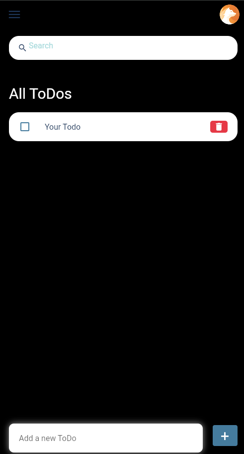
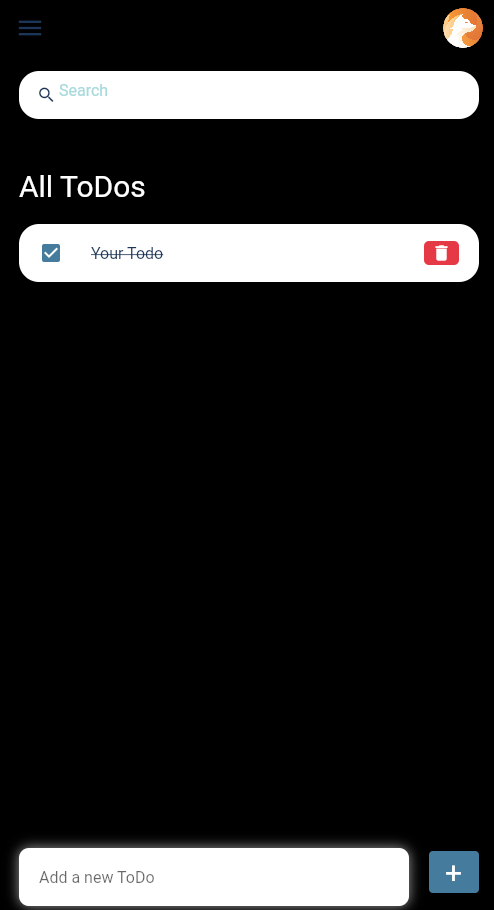

<!-- Generate some text for my flutter todo app make it professional -->
# Flutter Todo App
A simple todo app built with flutter. This app allows you to add and delete and mark todos as complete.

## Features
- Add todo
- Delete todo
- Mark todo as complete

## Screenshots

## Resources
- [Flutter Documentation](https://flutter.dev/docs)
- [Dart Documentation](https://dart.dev/guides)